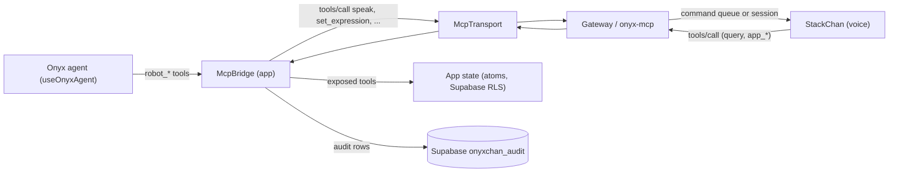

# MCP app bridge: architecture plan v1

Owner: Ramses. Date: 2026-10-04. Status: plan plus code skeleton (`src/features/onyxAgent/mcp/`), no transport implemented, nothing deployed, nothing pushed.

Sources read: `FW_PROTOCOL.md` (draft 1.1.0), `mcp.envelope.schema.json`, `command.schema.json`, `roles.json` (1.1.0-draft), `FW_CONTRACT_README.md`, `ONYXCHAN_MCP_SKILL.md` (audit of 2026-08-29), `ONYX_AGENT_FACE_PLAN.md`, `appTools.ts`, `robotTools.ts`, `useOnyxAgent.ts`. The `toolRegistry.ts`, `onyxchanTools.ts`, `onyxDataTools.ts`, `error.schema.json`, `common.schema.json`, `ack.schema.json` and the contract fixtures were **not** read (not provided): see section 9.

## 1. What is read and what is inferred

| Marker | Meaning |
|---|---|
| READ | stated in a file listed above |
| INFERRED | not stated; chosen here, needs confirmation |

READ: the envelope shape (`{type:'mcp', payload}`, JSON-RPC 2.0, closed objects); the command vocabulary and args; stable error codes; the tool-by-role table; that onyx-mcp enforces roles and field allowlists server-side; that a device command returns a command id at once and the ack is asynchronous; that `speak` needs an open session.

INFERRED: the exact args of the MCP tool names (`speak`, `set_expression`, ...) because they come from `onyxchanTools.ts`; the JSON-RPC numeric code per error code; the result shape of `tools/call` (`content` + `structuredContent` + `isError`, plus `command_id`); the names of the three new app tools (section 4); rate limit numbers.

## 2. Who calls whom

- **Outgoing (app to robot):** the agent picks a `robot_*` tool; the bridge maps it to the contract tool, adds `device_id`, checks role, assignment, args, rate limit and confirmation, sends `tools/call` with a fresh uuid as JSON-RPC id, and waits for the response (the ack when the call is a command).
- **Incoming (robot to app):** the robot's call reaches the bridge as a `tools/call` request; the bridge identifies the caller, applies the same gates, runs the handler against app state and answers.
- The contract treats the **app as `staff`** (Supabase JWT) or `agent` (PAT). A device never gets the app's JWT.

## 3. Transport options available today

The bridge is transport-agnostic (`McpTransport { send, onMessage }`). Candidates:

| Option | How | Pros | Cons |
|---|---|---|---|
| A. Edge function (`onyx-mcp`) over HTTPS | App POSTs `tools/call` with the staff JWT; onyx-mcp writes `onyxchan_commands`; ack comes back by polling or Realtime | Contract-native (app to onyx-mcp is JWT); role and redaction enforced server-side; works off-LAN; no new infra | Request/response only: the app cannot receive robot-initiated calls; ack latency up to one check-in (about 30 s on mains); function was **not deployed** at audit time (SKILL section 4) |
| B. Supabase Realtime channel (per device, private) | Broadcast both ways | Push both directions, simple in the browser, app already has `useDeviceChannel` | Contract says the ESP32 has no Realtime client and the gateway is the single device endpoint; RLS on channels must be proven (negative test 2); a second device path contradicts "one MCP surface"; the previous fallback hid failures (SKILL section 5) |
| C. Gateway WebSocket (`wss /v1/session`) | App opens its own socket to the gateway | Lowest latency, full duplex | Session endpoint is `voice` only by contract; no app role in the gateway auth table; min instances 0 and `--max-instances=1` make a browser socket expensive and fragile; gateway not deployed |
| D. Loopback | In-memory | Tests, mock fleet | Not a product path |

**Recommendation (INFERRED):** outgoing commands through **A**; robot-initiated calls to the app use **A in reverse**: the robot's call is evaluated by onyx-mcp, and the app learns of it through a Realtime subscription on the audit or command-result rows (B used only as a notification, never as a command path). Option C stays out until the contract adds an app role to the gateway. The seam stays the same either way: only the `McpTransport` implementation changes. A silent fallback to another path is forbidden: a failed send is `upstream_unavailable` and is audited.

## 4. Role and permission model

Two layers, both required:

1. **Contract role** (who is calling onyx-mcp): `voice`, `staff-device`, `staff` (app JWT), `agent` (PAT), `gateway`.
2. **App role** (signed-in user): from roles.json `Developer, Admin, ClientBoss, ClientAccounting, ClientViewer, Vendor, Client`.

| App role | Finance tools (`FINANCE_ROLES`) | Read inventory / logistics | Navigate | Command robots |
|---|---|---|---|---|
| Developer | yes | yes | all views | yes, **assigned devices** (INFERRED: roles.json says only Admin commands all; `robotTools.ts` treats Developer like Admin) |
| Admin | yes | yes | all views | yes, **all devices** (the only role) |
| ClientBoss | yes | yes | per `VIEW_ACCESS` (not defined for this role today) | no |
| ClientAccounting | yes | yes | same | no |
| ClientViewer | no | yes, cost redacted | same | no |
| Vendor | no | own vendor only (`vendorScoped`) | inventory, viewer | no |
| Client | no | read | inventory, viewer | no |

`appTools.ts` and `robotTools.ts` only know `Developer | Admin | Vendor | Client`; the bridge types the full set. The three missing roles need a `VIEW_ACCESS` entry (they currently resolve to no views).

Device roles (`voice`, `staff-device`) reach only the query tools in roles.json, with the field allowlists applied **by onyx-mcp**. The bridge never relaxes that: it only narrows.

Agent (PAT) callers: effective permission = issuer's permission AND issuer's device assignments AND token scopes. Scope names are placeholders (`read`, `device-command`, `payment`, `cost`); the bridge defaults to `read` for read tools and `device-command` for everything else.

## 5. Tool catalogues

### 5.1 Exposed to the robot (app serves them) - `createAppExposedTools`

| Tool | Kind | Name status | Allowed callers | Notes |
|---|---|---|---|---|
| `inventory_count_by_vendor` | read | contract | voice, staff-device, staff, agent | the only one roles.json lets a device reach; counts and vendor names only |
| `app_get_current_view` | read | **new** | staff, agent | current view id |
| `logistics_get_shipment` | read | contract | staff, agent (not Vendor / Client) | shipment status; **denied to voice** in roles.json |
| `app_change_view` | navigate | contract | staff, agent (`device-command`) | goes through the app's `VIEW_ACCESS` gate |
| `app_open_island_surface` | navigate | **new** | staff, agent | `commands` or `center` |
| `app_show_vendor_on_robot` | robot | **new** | staff, agent; Developer / Admin | shares the robot rate group |

Conflict to resolve with the contract owner: the task wants the **robot** to read the current view and shipment status and to navigate, but roles.json lists every `app_*` tool and `logistics_get_shipment` under `denied_tools` for `voice`. Until the contract is amended, those tools answer `forbidden` to a device and are reachable only by `staff` / `agent` callers (an operator or PAT relaying through the robot).

### 5.2 Robot tools the app agent calls - `createRobotCallTools`

| Agent tool (robotTools.ts) | Contract tool | Device command | Mapping notes |
|---|---|---|---|
| `robot_say` | `speak` | `speak` | `ja` not allowed (contract dropped it): coerced to `es`; text cap 256; needs open session |
| `robot_face` | `set_expression` | `face` | `duration` seconds becomes `duration_ms`; `vendor-display` / `inventory-display` are no longer expressions |
| `robot_move` | `move_head` | `move` | pan -90..90, tilt 0..90 |
| `robot_show_vendor_card` | `display_vendor_card` | `vendor-display` | max 4 details; optional `icon` |
| `robot_show_item_card` | `display_inventory_card` | `item-card` | `price` is USD; onyx-mcp strips it for voice devices |
| `robot_status` (new agent name) | `get_robot_status` | - | read |
| `robot_ping` (new agent name) | `ping_robot` | - | read |

Not callable (no contract tool): `vision` (only in the legacy skill doc), `tts` (the contract name is `speak`), `gif` (devices answer `unsupported`), `play_tone` (staff-device only, no tool yet), `payment-card` (finance staff JWT only, never from the model; fields undefined).

## 6. Safety

| Control | Design |
|---|---|
| Confirmation | Any `write` tool, or a definition flagged `requiresConfirmation`, calls the injected `confirm()`; without it the call is refused. Robot face / move / say stay unconfirmed, as in the agent plan (risk class `robot`, logged). `payment-card` is never exposed. Agent plan v1 ships no data-writing tool. |
| Rate limit | Sliding window per tool, plus one shared `robot` group (1 command per second, as `robotTools.ts`). Defaults: read 30/10 s, navigate 10/10 s, robot 1/s. Over the limit: `rate_limited`. Gateway caps (open question 7) apply on top. |
| Audit | Every call, in and out, allowed or refused, gives an `AuditEntry` (id, time, direction, tool, risk, caller role, app role, device, outcome, code, duration, redacted args). Kept in a 500-entry ring; `onAudit` persists to a Supabase table (proposed `onyxchan_audit`, insert-only RLS, one row per call, no cost or payment fields; keys matching token / secret / payment / cost are masked). Persistence failure never blocks a call. |
| Kill switch | `bridge.kill()` and `options.isKilled()` (mirror of a Supabase flag) refuse all traffic with `session_closed` and fail pending calls. Server-side, revoke the device token (contract runbook). |
| Server authority | Field redaction, role table and device assignment are enforced by onyx-mcp; the bridge is a second gate. It never holds a token: the transport owns auth, nothing is logged with a secret. |
| Untrusted content | Tool results and model text are data, never evaluated (agent plan section 6). |

## 7. Failure modes

| Failure | Behaviour |
|---|---|
| Transport send fails | `upstream_unavailable`, audited, no retry (commands are idempotent by id but the caller decides). |
| No response in time (default 15 s) | `upstream_unavailable` (`timeout` in audit). A sleeping device may still run the command later (lease and expiry rules); the caller must not assume it did not. |
| Device asleep | Command waits up to one check-in (about 30 s mains); `speak` expires if not claimed in time. |
| Device answers `unsupported` | surfaced as the error code; no silent drop. |
| Duplicate delivery | the JSON-RPC id is the command id; devices re-ack duplicates. |
| Malformed frame | dropped, never answered, never crashes. |
| Unknown caller | `unauthorized`. Unknown tool / method: `unknown_tool`. |
| Kill switch on | `session_closed`. |
| Several robots online | `getDeviceId()` decides (agent plan question 3: the one selected in the panel). |
| Contract drift | schema is strict, so a new field is rejected loudly instead of ignored. |

## 8. Wiring (not done here)

1. Implement a transport (`McpTransport`) for option A.
2. `createMcpBridge({ transport, catalog, getCaller, getAppRole, getDeviceId, isDeviceAssigned, confirm, onAudit })` with the catalog filled by `createRobotCallTools()` and `createAppExposedTools(deps)`.
3. Pass `bridge.toAgentTools()` as one entry of `useOnyxAgent({ extraTools })`. It replaces the direct `createRobotToolHandlers` path only when the bridge transport is live; the two share the `robot_*` names, so register only one.
4. Add the `onyxchan_audit` migration and the kill-switch flag.

## 9. Gaps and unmapped contract fields

- `error.schema.json`, `common.schema.json`, `ack.schema.json`, `hello`, `checkin`, `event`, `call`, `notify` schemas and audio frames were not available: the bridge covers only the `mcp` envelope.
- The command row fields `status`, `created_at`, `expires_at`, `claimed_at`, `attempts` are queue state, not on the envelope: not modelled.
- `session_id` in the envelope (open question 3) and numeric JSON-RPC code mapping (30) are open.
- Ack result shape is undefined; the bridge reads `command_id` from the result if present.
- `payment-card`, `gif`, `play_tone` args and `vision` have no usable definition.
- Scope names are placeholders; Developer's device rights are ambiguous.
- Server-side field allowlists cannot be reproduced client-side; only key masking in the audit exists.
