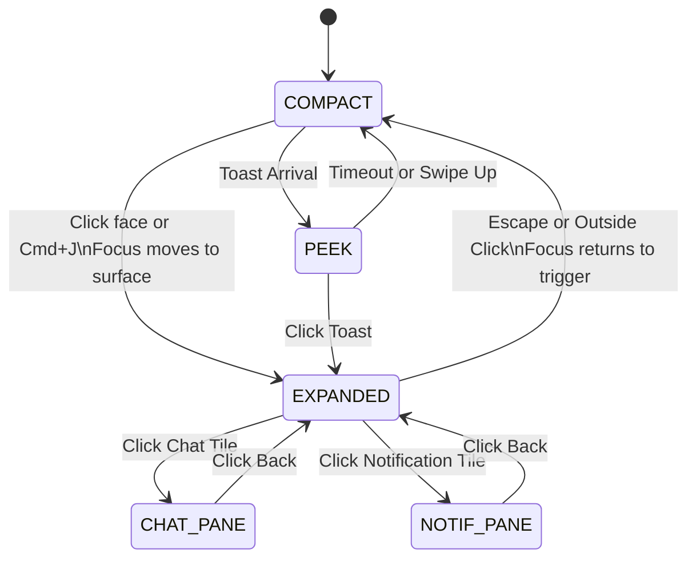

# Onyx Island States and Tools Design (PI2)

## 1. State Machine

The Onyx Island absorbs all top bar tools into a fluid command surface. `center` mode is deprecated; chat and notifications become in-place panes within `EXPANDED`.



## 2. Exact Layout

The visual language uses Liquid Glass (translucent tint, backdrop blur `blur(26px)`, lit rim, specular sheen) and Apple HIG rules.

- **Desktop (1440px)**
  - **COMPACT:** Height 56px. Fits up to 6 pinned launchers (3 on the left, 3 on the right of the face) alongside the docked readouts.
  - **EXPANDED:** 720px max width, deploying downwards outside the bar. Grid: 4 columns.
- **Laptop (1024px)**
  - **COMPACT:** Height 56px. Fits up to 4 pinned launchers.
  - **EXPANDED:** 600px width. Grid: 3 columns. Max height 540px.
- **Tablet (768px)**
  - **COMPACT:** Height 56px. Fits up to 2 pinned launchers.
  - **EXPANDED:** 480px width. Grid: 2 columns.
- **Phone (390px)**
  - **COMPACT:** Height 56px. 0 pinned launchers (only face and readouts).
  - **EXPANDED:** Displays as a Bottom Sheet anchored to the bottom of the screen. 100vw width, max 80vh height. Swipe to dismiss.
- **Radii:** 32px for COMPACT. 28px for EXPANDED (matching HIG modality popovers).
- **Density:** Minimum 44x44px touch targets for mobile, desktop icons 28x28px padded to 44x44px. Labels truncate at 12 characters (`max-w-[12ch] text-ellipsis line-clamp-1`). Overflow launchers move into the EXPANDED tool grid.

## 3. Motion

All transitions use Framer Motion with shared `layoutId`s to morph between modes without disjointed swaps.

- **Springs:** Using tokens from `src/features/onyxIsland/motion/tokens.ts`.
  - `SPRING` (`stiffness: 380, damping: 36, mass: 0.9`) for bounds resizing (morphing between COMPACT and EXPANDED).
  - `SPRING_SLOW` (`stiffness: 280, damping: 34, mass: 1`) for internal content crossfades.
- **Morphing:** The island container and the OnyxFace use `layoutId="onyx-island"` and `layoutId="onyx-island-face"`.
- **Reduced Motion:** If `useReducedMotion()` is true, transitions fall back to `{ duration: 0 }`, causing instantaneous mode switching.

## 4. Accessibility

- **Roles:** The COMPACT launchers wrapper uses `role="toolbar"`. The EXPANDED surface uses `role="dialog"` with `aria-modal="true"`. Tool groups use `role="tablist"`.
- **Keyboard Navigation:** Roving `tabindex` in the toolbar (active tool gets `0`, others `-1`, navigated with arrow keys).
- **Shortcut:** `Cmd+J` (Mac) / `Ctrl+J` (Windows) toggles EXPANDED mode. This avoids clashes with browser shortcuts like `Cmd+K`.
- **Focus Return:** When EXPANDED closes via Escape, focus is returned to `document.activeElement` recorded prior to opening.
- **Announcements:** `aria-live="polite"` announces toasts. Opening EXPANDED announces "Onyx command surface expanded".

## 5. Tool Registry

Modules register their tools dynamically using `ToolDescriptor`.

```typescript
interface ToolDescriptor {
    id: string;
    moduleId: string; // e.g. 'inventory', 'archived'
    label: string;
    icon: React.ElementType; // Lucide component
    kind: 'action' | 'toggle' | 'widget';
    group: string;
    order: number;
    roles: string[]; // e.g. ['Admin', 'Developer']
    pinned: boolean; // Default pin state
    run?: () => void;
    pressed?: boolean; // For toggles
    badge?: number | string;
    render?: () => React.ReactNode; // For complex widgets (e.g., search box, selects)
}
```

- **Registration:** Tools are aggregated via Jotai atoms per module (e.g., `inventoryToolsAtom`), combined in a derived global `activeModuleToolsAtom` based on `activeView`.
- **Persistence:** Pinned preferences (`Record<string, boolean>`) are saved per-user and per-module in RxDB/Supabase user settings.
- **Widgets:** Complex widgets (like `DeployableSearch` from `MainHeader.tsx:495`) use the `render` function to mount their UI inside a grid tile.

## 6. Migration Strategy

- **Feature Flag:** Introduce `ENABLE_ISLAND_COMMANDS` in settings. While `false`, old bars render. While `true`, `UniversalToolsBar.tsx` and module-specific bars (`InventoryBar.tsx`, `ArchivedToolsBar.tsx`) are hidden.
- **Top Bar Remainder:** `MainHeader.tsx` will only contain the sidebar toggle (left) and the Onyx.mx logo (left-center). All other controls move to the island.
- **Rollout Order:** 
  1. `Archived` (already centralized in `ArchivedChrome.tsx`).
  2. `Inventory` (highly utilized, `InventoryBar.tsx`).
  3. `Packing`, `Logistics`, `Store`, `Finance`.
- **Parity Checklist Template:**
  - [ ] Tools registered in `moduleState.ts`.
  - [ ] Custom widgets wrapped in `render`.
  - [ ] Role permissions (`user.role`) verified.
  - [ ] Tested at 1440px, 768px, and 390px.

## 7. Performance and Risks

- **Performance:** 
  - The EXPANDED surface is lazily loaded (`React.lazy`).
  - Notifications list uses Jotai `selectAtom` for unread counts to prevent re-rendering the whole island when a new notification drops. No heavy libraries added.
- **Risks & Mitigations:**
  - *Risk:* EXPANDED surface obscures critical content. *Mitigation:* Dismisses immediately on click outside or scroll.
  - *Risk:* Complex widget dropdowns get clipped by `overflow: hidden` on the liquid glass surface. *Mitigation:* `render()` widgets must use `createPortal` to attach their dropdown menus to `document.body`.
  - *Risk:* Clutter in EXPANDED mode. *Mitigation:* Tools are strictly grouped by `group` property.

## 8. Implementation Tasks

1. **Tool Registry Architecture**
   - *Files:* `src/lib/toolRegistry.ts` (new), `src/features/onyxIsland/islandState.ts`
   - *Criteria:* Define `ToolDescriptor`, create global `toolsAtom` and user-specific `pinnedToolsAtom`.
   - *Dependencies:* None.

2. **Refactor State Machine**
   - *Files:* `src/features/onyxIsland/islandState.ts`
   - *Criteria:* Remove `center` mode. Add `chat_pane` and `notif_pane` states inside EXPANDED.
   - *Dependencies:* Task 1.

3. **COMPACT Mode Launchers**
   - *Files:* `src/features/onyxIsland/OnyxIsland.tsx`, `src/features/onyxIsland/island.css`
   - *Criteria:* Modify `onyx-island-dock` (line 77) to render pinned tools beside the face with `role="toolbar"`. Ensure 32px radius and Liquid Glass styles.
   - *Dependencies:* Task 2.

4. **EXPANDED Surface Container**
   - *Files:* `src/features/onyxIsland/OnyxIsland.tsx`
   - *Criteria:* Build the downward deploying container using `SPRING`. Implement click-outside and `Cmd+J` listeners.
   - *Dependencies:* Task 3.

5. **Tool Grid UI**
   - *Files:* `src/features/onyxIsland/IslandToolsGrid.tsx` (new)
   - *Criteria:* Render groups and tools. Truncate labels > 12 chars. Ensure 44x44px touch targets. Execute `render()` for widgets.
   - *Dependencies:* Task 4.

6. **Mobile Bottom Sheet**
   - *Files:* `src/features/onyxIsland/OnyxIsland.tsx`
   - *Criteria:* Add media queries. If `<768px`, render EXPANDED anchored to bottom using `drag="y"` constraints.
   - *Dependencies:* Task 5.

7. **Chat & Notification Panes**
   - *Files:* `src/features/onyxIsland/NotificationCenter.tsx` (lines 106-246), `src/features/onyxIsland/OnyxIsland.tsx`
   - *Criteria:* Strip internal tabs. Convert to render as an in-place pane inside `IslandToolsGrid.tsx` when a tile is clicked.
   - *Dependencies:* Task 5.

8. **Keyboard Accessibility**
   - *Files:* `src/features/onyxIsland/IslandToolsGrid.tsx`
   - *Criteria:* Add roving tabindex to grid items. Focus returns to trigger when unmounting.
   - *Dependencies:* Task 5.

9. **Feature Flag & Top Bar Cleanup**
   - *Files:* `src/features/core/MainHeader.tsx`, `src/features/core/UniversalToolsBar.tsx`, `src/lib/atoms.ts`
   - *Criteria:* Add `ENABLE_ISLAND_COMMANDS`. Conditionally hide `UniversalToolsBar` and module bars (lines 4363-4372).
   - *Dependencies:* Task 8.

10. **Migrate Archived Module**
    - *Files:* `src/features/archived/ArchivedChrome.tsx`, `src/features/archived/archivedState.ts`
    - *Criteria:* Register Search, Sort, View, and Density as island tools.
    - *Dependencies:* Task 9.

11. **Migrate Inventory Module**
    - *Files:* `src/features/inventory/InventoryBar.tsx` (lines 844-908)
    - *Criteria:* Register tools: Add, Actions, Tools, View, Filter, Search, Tags.
    - *Dependencies:* Task 9.

12. **Widget Dropdown Portals**
    - *Files:* `src/components/ui/Dropdown.tsx` (or relevant dropdown primitives)
    - *Criteria:* Guarantee dropdowns inside `render()` tools don't clip inside the `.onyx-island-surface` `overflow: hidden`.
    - *Dependencies:* Task 5.
