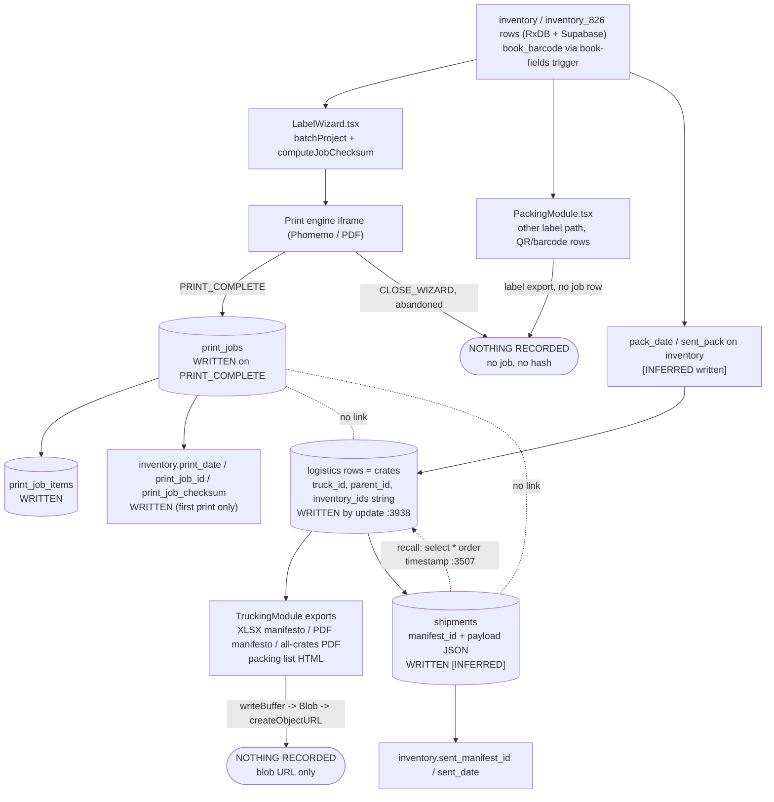

# PM4 tracking audit: printing, labelling, packing, shipping (2026-10-04)

**Sources (read once, whole):** `docs/print/DIGEST_TRACKING.md` (cited as `D:<line>`, digest line numbers) and `src/lib/seasons.ts` (cited as `seasons.ts:<line>`). Source-file line numbers (e.g. `database.types.ts:968`) are quoted from the digest's own prefixes.

**Legend:** **[READ]** = visible in a source. **[INFERRED]** = deduced, must be checked against the live schema or full file. The digest is capped and elided in places (`...`), so absence of something in the digest is *not* proof it is absent in the repo. I could not query Supabase: no RLS policy, trigger body, index, constraint or row count was seen.

---

## 1. What exists today

### 1.1 `print_jobs` [READ] `database.types.ts:1000-1038` (D:39-77)

| Column | Type | Notes |
|---|---|---|
| `id` | string, required on Insert | client-generated: `PJ-${Date.now().toString(36).toUpperCase()}` (`LabelWizard.tsx:822`) |
| `checksum` | string \| null | SHA-256 hex, see 1.5 |
| `is_reprint` | boolean | default on server (optional in Insert) |
| `item_count`, `label_count` | number | default 0 |
| `label_size` | string \| null | e.g. `50x50` (`LabelWizard.tsx:788` picks template by `activeLabelSize`) |
| `notes` | string \| null | |
| `printed_at` | string | defaulted; client sends `stamp` (`:506`) |
| `printed_by` | string \| null | `user?.email \|\| user?.name` (`:507`), a free-text identity, not a user id |
| `source` | string | default; value written by LabelWizard not visible (lines 511-519 elided) |

`Relationships: []` (`:1037`): no FK to inventory, shipment, crate, season or user.

### 1.2 `print_job_items` [READ] `database.types.ts:968-999` (D:7-38)
`id`, `job_id` (FK `print_job_items_job_id_fkey` -> `print_jobs.id`), `inventory_id` (string\|null, **no FK**), `tag_id` (string\|null, = `codes.bookBarcode`, `LabelWizard.tsx:816`), `labels_printed` (default 1; `perTag.get(tag) ?? 1`, `:524`). Written in chunks of 100 (`:527-530`).

### 1.3 `shipments` [READ] `database.types.ts:1111-1137` (D:152-177)
`id`, `manifest_id` (required), `metadata: Json`, `payload: Json`, `timestamp`, `updated_at`. Manifest id format `ONYX MX - ${dateStr}` (`TruckingModule.tsx:2847`). Everything of substance (crates, items, weights) lives inside `payload` JSON [INFERRED from `shipmentPayload`, `:2902`]. Read back with `select('*').order('timestamp', desc)` (`:3507-3509`) and "recalled" (`:3547`). **No season column, no FK, no checksum column.** Whether a payload hash is stored inside `metadata` is unknown.

### 1.4 `logistics` [READ] `database.types.ts:706-738` (D:106-137)
`id`, `parent_id`, `truck_id`, `truck_position`, `type`, `status`, `carrier`, `tracking_number`, `customs_status`, `date`, `ship_date`, `origin`, `destination_address`, `description`, `contents_summary`, `crate_count`, `pallet_count`, `quantity`, `length_cm/width_cm/height_cm/weight_kg`, `cost_mxn`, `freight_cost`, `insurance_value`, `pay_req`, `vendor_id`, `vendors` (string), `inventory_ids` (**string**, not array, not FK), `updated_at`.
- Crates appear to be `logistics` rows with `type` = crate and `parent_id`/`truck_id` pointing at a truck/pallet row [INFERRED; no `crates` table appears in the digest]. Persistence is `supabase.from('logistics').update({...})` (`TruckingModule.tsx:3938`; body elided).
- Season variant: `logistics_826` (`seasons.ts:5`). Its columns and whether it is in `database.types.ts` are **not** shown [INFERRED to mirror `logistics`]. Legacy `logistics` holds v326/v825 (`seasons.ts:6`).
- `logistics` has no season/workbook column; season is stamped client-side at sync from the source table (`seasons.ts:8-10`, `getSeasonSources` in `database.ts`, not seen).

### 1.5 Inventory print provenance [READ]
`database.ts:207, 220-221` and RxDB schema: `print_date`, `print_job_checksum`, `print_job_id` (plus `pack_date`, `sent_manifest_id`, `sent_date`, `sent_pack`, `sent_notes`, `payment_requested_at`, server-derived `lifecycle_status`, `payment_status`, `shipped`: `database.ts:213-227`).
- Comment `database.ts:218-219`: a checksum means "the tag physically printed", a date only means the wizard ran.
- `inventoryCreate.ts:153-161`: `labelPrinted(row)` is true if a stored barcode exists **or** print records exist; "LabelWizard ... writes only print_date / print_job_checksum / print_job_id back (the trigger keeps labels_printed_total)".
- `inventoryCreate.ts:24-26`: an existing `book_barcode` is never recomputed (it is on a label).
- `inventory.sent_manifest_id` is the only inventory-to-shipment pointer [READ `database.ts:217`], a single value per row (a re-shipped item overwrites it).

### 1.6 Triggers mentioned in comments (bodies NOT seen)
1. **book-fields trigger** (`inventoryCreate.ts:13-14`): fills `book_barcode` and `book_aq_code` when NULL; mistook the `'-'` sentinel for a printed barcode. Uses `DEFAULT_EXCHANGE_RATE` 17 (`:22`).
2. **labels_printed_total trigger** (`inventoryCreate.ts:156-157`): maintains a running label count on inventory [INFERRED: fires on `print_job_items` insert, source table not named].
3. Derived-status logic (`database.ts:223-224`): "Derived server-side": trigger or generated column, unknown.
4. Functions seen: `get_my_app_role()`, `get_my_vendor_prefix()` (`database.types.ts:1143-1144`), usable for RLS.

### 1.7 Checksum algorithm [READ `LabelWizard.tsx:455-470, 811-824`]
| Aspect | Fact |
|---|---|
| Function | `computeJobChecksum(batch)` (`:461`) |
| Input | `batch` = `batchProject`, the label designer project object: master template (`ONYX_MASTER_TEMPLATE_50x50` or `_V4`, `:788`) + `name: Onyx_Batch_<YYYY-MM-DD>` (`:789`) + `templateData` rows, each record repeated `QUANTITY` times (`:783-785`) [last two partly INFERRED as the object returned at `:787`, passed to the checksum at `:821`] |
| Canonicalisation | **None.** `JSON.stringify(batch)`: key order = object construction order, whitespace none, `undefined` dropped, no number/date normalisation |
| Encoding / hash | `TextEncoder` UTF-8 -> `crypto.subtle.digest('SHA-256')` -> lowercase hex, 64 chars |
| Failure | `catch` returns `''` (`:467-469`): an empty string can be stored as checksum (insert at `:505` passes `job.checksum` verbatim). `crypto.subtle` is also unavailable on non-secure HTTP origins [INFERRED trigger for this] |
| Computed | in browser, at job creation before the print dialog opens (`:821`), stored in `pendingPrintJobRef` (`:453`) |
| Stored | `print_jobs.checksum` (`:505`) and, for non-reprints, `inventory.print_job_checksum` (`:538`); **not** per item |
| Deterministic? | The code comment claims "the same batch yields the same checksum" (`:459`). **Only partly true:** the payload includes `name` with today's date, so the same items hashed on another day differ [INFERRED from `:789`]; key order depends on code paths; a `QUANTITY` change alters the hash. It hashes the *payload sent to the engine*, not the printed output (no bytes of the Phomemo/PDF output exist client-side). Comment at `:456-457` says "stored per item": the inventory row does carry it, `print_job_items` does not. |
| Not reproducible later | The checksum input is not persisted anywhere, so it cannot be recomputed: **write-only token** today. |

### 1.8 Job lifecycle [READ unless noted]
1. **Create (pending):** on wizard print click, `pendingPrintJobRef = { ids, tagById, checksum, jobId, isReprint }` (`:453, 813-824`). In memory only; nothing in Supabase.
2. **Print/commit:** `PRINT_COMPLETE` or `PRINT_DONE` message from the designer iframe calls `commitPrintJob(payload, reason)` (`:861-863`). Sequence (`:503-546`): insert `print_jobs`; insert `print_job_items` in batches of 100; if not reprint, update `inventory` (`print_date`, `print_job_checksum`, `print_job_id`, `updated_at`) in batches of 50 (`:535-543`); set `lastPrintJob` state; toast.
3. **Abandon:** `CLOSE_WIZARD` clears `pendingPrintJobRef` (`:864-876`): nothing recorded.
4. **Reprint:** `is_reprint` true; original `print_date` is preserved (`:532-534`); the inventory `print_job_id`/`checksum` thus keep pointing at the **first** job [INFERRED from the conditional wrapping lines 535-543, the condition itself is elided]. A reprint has no pointer to its parent job.
5. **Void / cancel after the fact:** no column, status or code path. **Does not exist.**
6. **Failure handling:** errors in the three writes are caught; toast "Labels printed, but the job was not logged" (`:549-551`). The writes are separate requests, not transactional: a job can exist with partial or no items/inventory stamps, and nothing retries.
7. **Offline:** insert goes straight through `supabase` (`:503`); no RxDB queue for print jobs [INFERRED; `print_jobs` is not in the RxDB schema excerpt].

---

## 2. Data-flow diagram



Writes: `print_jobs`, `print_job_items`, inventory stamps (`LabelWizard.tsx:503-543`), `logistics` update (`TruckingModule.tsx:3938`), `shipments` (inferred by the read at `:3507` and `shipmentPayload` at `:2902`). No record: every export card (`TruckingModule.tsx:2245-2264`), the packing-list HTML (`:2902-2903`), and PackingModule's own label/QR generation (`PackingModule.tsx:150-187, 583-584`).

---

## 3. Gaps

| # | Gap | Evidence |
|---|---|---|
| G1 | **XLSX consolidated manifesto** leaves no trace: built with ExcelJS, `writeBuffer` -> `Blob` -> `createObjectURL`, progress state only | `TruckingModule.tsx:1937-1965` |
| G2 | **PDF trailer manifest / per-crate manifest / all-crates PDFs (with and without photos)** no trace; `exportCrateManifesto(..., 'blob')` | `:2055, 2662, 2245-2264` |
| G3 | **Packing-list HTML** (`generatePackingListHtml`) is a Blob; only `shipments` payload might store the inputs, not the output | `:2902-2903` |
| G4 | **PackingModule labels**: second label path builds `templateData` with `multiplier` and QR rows; no `print_jobs` insert seen in digest. `setLastPrintedIds` is local state | `PackingModule.tsx:156, 187, 584, 694-695` (checking the unseen file for a commit is required: INFERRED) |
| G5 | **Abandoned / failed prints** are deliberately not recorded; there is no `requested`/`rendered` state, so a printer failure and "never tried" are indistinguishable | `LabelWizard.tsx:864-876` |
| G6 | `print_jobs` has **no season**, no template id/version, no shipment/crate link, no user id (email string), no printer/channel, no void. `source` semantic unknown | `database.types.ts:1000-1012` |
| G7 | `print_job_items.inventory_id` has no FK and no season; items in `inventory` vs `inventory_826` are ambiguous by id alone (item_id `VENDOR-NNN` unique only per workbook: `inventoryCreate.ts:20-21`) | |
| G8 | **Crate/shipment linkage is stringly-typed:** `logistics.inventory_ids` is a string; `shipments.payload` is free JSON; `inventory.sent_manifest_id` is single-valued; no label -> crate link at all | `database.types.ts:720, 1116`; `database.ts:217` |
| G9 | **Season scoping:** `shipments` has no season; `logistics` has none (only the `_826` table split); `print_jobs` none. Season is inferred by table of origin or `workbook` (`seasons.ts:8-10, 32-33, 63-69`). A v826 row in a legacy table is still 826 (`seasons.ts:28-30`), so table-based season for jobs can be wrong. Note `rowWorkbook` folds unknown workbook into `v326` (`:68`): silent mis-bucketing. |
| G10 | **Cannot re-verify:** checksum input not stored; no canonical form; includes a date in `name`; `''` on error; no hash of output bytes; no hash of manifests or shipment payloads |
| G11 | Reprint has no parent link; inventory keeps the first job pointer; reprint count only via `print_jobs.is_reprint` rows joined by items |
| G12 | Non-atomic multi-request commit; no retry; no offline queue (1.8-6/7). A job can exist with zero items (`item_count` > rows) |
| G13 | `printed_by` is email/name text; can be null; not auditable against `auth.users` |
| G14 | Client-generated `PJ-<base36 ms>` id: two operators in the same ms collide; insert rejects second job and the toast says "not logged" |
| G15 | Hard-coded Supabase function URL for the QR in `PackingModule.tsx:150, 187, 583` ties label content to one project; a change of project invalidates printed QRs (not secret, but undocumented coupling) |
| G16 | No append-only guarantee: `Update` type permits editing `checksum`, `printed_at`, `labels_printed` (`:1025-1036`) [RLS unknown] |

---

## 4. Proposed unified ledger: `document_jobs`

### 4.1 Design principle
One ledger for **every generated artefact**, label or file. Wrap, do not replace: `print_jobs` / `print_job_items` and the three inventory columns stay as-is and keep their trigger. The label path **dual-writes** and each legacy job gets a ledger row pointing back to it.

### 4.2 Tables
**`document_jobs`** (immutable header, one row per generation event; a reprint is a new row):
`id uuid` (client-generated, idempotent key), `job_ref text unique` (human id, e.g. `DJ-826-<ulid>`; legacy `PJ-...` kept in `legacy_print_job_id`), `kind` (`xlsx|pdf|label|csv`), `template_id`, `template_version`, `season` (`'826'|'legacy'`) plus `workbook` (`v826|v825|v326`, from `rowWorkbook`), `shipment_id`/`manifest_id`, `crate_logistics_id`, `batch_id`, `parameters jsonb`, `data_snapshot jsonb` (optional, or storage pointer), `data_hash`, `hash_version`, `output_sha256`, `output_bytes`, `file_name`, `channel` (`phomemo:<device>|browser-download|print-dialog`), `created_by uuid` (auth.uid) + `created_by_label`, `parent_job_id` (reprint/regenerate), `legacy_print_job_id` (FK `print_jobs.id`), `app_version`, `created_at`, `client_created_at`.

**`document_job_events`** (append-only status history): `id`, `job_id`, `status` (`requested|rendered|printed|downloaded|reprinted|void`), `at`, `by`, `detail jsonb`, `output_sha256` (when the status is `rendered`). Current status = latest event (view `document_jobs_current`). Status is separated so the header can stay strictly immutable.

**`document_job_items`**: `job_id`, `inventory_id`, `season`, `tag_id`, `item_ref`, `crate_logistics_id null`, `copies`. Replaces the stringly-typed `inventory_ids` for new jobs. Legacy `print_job_items` remain authoritative for pre-migration labels.

### 4.3 Relationship to existing tables
| Existing | Action |
|---|---|
| `print_jobs`/`print_job_items` | **Keep and keep writing** (the labels_printed_total trigger and `labelPrinted()` depend on them). New code writes ledger first, then legacy rows with `document_jobs.legacy_print_job_id = print_jobs.id`. Backfill: one `document_jobs` row (kind `label`, status event `printed`, `hash_version = 0`, `data_hash = print_jobs.checksum`) per existing `print_jobs` row. |
| `inventory.print_job_*` | Unchanged semantics. Add nothing; optionally a view `inventory_latest_document` joining the newest job by item. |
| `shipments` | Add nullable `season`, `manifest_hash`; ledger rows link by `manifest_id`. Do not change `payload`. |
| `logistics` / `logistics_826` | Ledger links by `crate_logistics_id` (no schema change); season is the ledger's own column, so the logistics table split stops mattering. |

Migration steps (each shippable alone): (1) create tables, no client change; (2) client `recordDocumentJob` for XLSX/PDF/HTML exports (zero impact on labels); (3) label dual-write; (4) backfill legacy jobs; (5) reports; (6) only after months of parity consider deprecating direct `print_jobs` writes. Nothing drops or renames.

### 4.4 Checksum scheme (`hash_version = 1`, string prefix `dj1:`)
**Two hashes, different purposes:**
- `data_hash`: hash of the *canonical data snapshot* the document is built from. Reproducible: same data -> same hash, regardless of day, operator or renderer.
- `output_sha256`: SHA-256 of the exact bytes handed to the user or printer. Informational and tamper-evidence for *that copy*; **not** expected to match on regeneration (XLSX zip timestamps, PDF `CreationDate`/ids are non-deterministic) [general knowledge, not from sources].

**Canonical form v1** (JSON, then UTF-8, then SHA-256, lowercase hex):
1. Envelope: `{ "v":1, "kind", "template":{"id","version"}, "season":"826", "scope":{...ids...}, "params":{...}, "rows":[...] }`.
2. Object keys sorted by Unicode code point, recursively; no whitespace; RFC 8785 (JCS) style.
3. Strings NFC-normalised and trimmed; no `-`/`—` sentinels (match `inventoryCreate.ts:27`): empty -> `null`.
4. Numbers: finite only; money as integer minor units or fixed string (`"12.50"`); no exponent; `-0` -> `0`. Weights fixed to 3 dp.
5. Dates: ISO 8601 UTC with `Z`, ms precision; date-only fields as `YYYY-MM-DD`.
6. **Excluded volatile fields:** project `name` (`Onyx_Batch_<date>`), job ids, `printed_at`, user, output URLs, `updated_at`.
7. Rows sorted by stable key `(season, vendor_prefix, item_id)`; label rows are **not** expanded by `QUANTITY`: carry `copies` per row instead (the current expansion at `LabelWizard.tsx:783-785` makes the hash depend on duplication).
8. Failure to hash is an error; never store `''` (fixes `LabelWizard.tsx:467-469`). Fall back to a pure-JS SHA-256 when `crypto.subtle` is unavailable.
9. Any change to the rules bumps `hash_version`; old versions' canonicaliser stays in code forever.

**Verification procedure `verifyDocumentJob(id)`:**
1. Load job + `hash_version`, `template`, `scope`, `params`.
2. Rebuild the snapshot from live data using the stored scope (inventory ids by season, crate rows, shipment payload) with the v`hash_version` builder.
3. Canonicalise and hash; compare with `data_hash`: `match` / `mismatch` (with a diff of changed item ids if `data_snapshot` was stored) / `unverifiable` (version 0 legacy rows, or data deleted).
4. If a file is supplied (re-upload or stored copy), hash bytes; compare with `output_sha256`.
5. Append a `document_job_events` row `verified` result in `detail` only if opted in (keep status set closed; verification results go in an events `detail`, not a new status).
Legacy `PJ-` checksums (version 0) are unverifiable because the input was never stored (1.7); label them as such rather than as a mismatch.

---

## 5. SQL migration DRAFT

> **DRAFT NOT APPLIED.** Written without access to the live schema. Verify role strings returned by `get_my_app_role()` (`'Developer'`, `'Admin'` assumed) and the `auth.users` link before running.

```sql
-- DRAFT NOT APPLIED
-- 2026-10-04 - document_jobs ledger. Additive only. No existing object is altered or dropped.
begin;

create table public.document_jobs (
  id                   uuid primary key default gen_random_uuid(),
  job_ref              text not null unique,
  kind                 text not null check (kind in ('xlsx','pdf','label','csv')),
  template_id          text not null,
  template_version     text not null,
  season               text not null check (season in ('826','legacy')),
  workbook             text check (workbook in ('v826','v825','v326')),
  manifest_id          text,                 -- shipments.manifest_id (no FK: shipments.manifest_id not known unique)
  crate_logistics_id   text,                 -- logistics.id / logistics_826.id (no FK: two source tables)
  batch_id             text,
  parameters           jsonb not null default '{}'::jsonb,
  data_snapshot        jsonb,
  hash_version         smallint not null default 1,
  data_hash            text not null check (data_hash <> ''),
  output_sha256        text check (output_sha256 is null or output_sha256 ~ '^[0-9a-f]{64}$'),
  output_bytes         bigint check (output_bytes is null or output_bytes >= 0),
  file_name            text,
  channel              text,
  parent_job_id        uuid references public.document_jobs(id),
  legacy_print_job_id  text references public.print_jobs(id),
  app_version          text,
  created_by           uuid not null default auth.uid(),
  created_by_label     text,
  client_created_at    timestamptz,
  created_at           timestamptz not null default now()
);

create table public.document_job_events (
  id          uuid primary key default gen_random_uuid(),
  job_id      uuid not null references public.document_jobs(id),
  status      text not null check (status in ('requested','rendered','printed','downloaded','reprinted','void')),
  at          timestamptz not null default now(),
  by          uuid not null default auth.uid(),
  output_sha256 text check (output_sha256 is null or output_sha256 ~ '^[0-9a-f]{64}$'),
  detail      jsonb not null default '{}'::jsonb
);

create table public.document_job_items (
  job_id              uuid not null references public.document_jobs(id),
  inventory_id        text not null,
  season              text not null check (season in ('826','legacy')),
  tag_id              text,
  item_ref            text,
  crate_logistics_id  text,
  copies              integer not null default 1 check (copies >= 0),
  primary key (job_id, inventory_id)
);

create index document_jobs_season_kind_created_idx on public.document_jobs (season, kind, created_at desc);
create index document_jobs_manifest_idx            on public.document_jobs (manifest_id) where manifest_id is not null;
create index document_jobs_crate_idx               on public.document_jobs (crate_logistics_id) where crate_logistics_id is not null;
create index document_jobs_parent_idx              on public.document_jobs (parent_job_id) where parent_job_id is not null;
create index document_jobs_created_by_idx          on public.document_jobs (created_by);
create unique index document_jobs_legacy_pj_uidx   on public.document_jobs (legacy_print_job_id) where legacy_print_job_id is not null;
create index document_job_events_job_idx           on public.document_job_events (job_id, at desc);
create index document_job_items_inv_idx            on public.document_job_items (inventory_id, season);

-- latest status per job
create view public.document_jobs_current with (security_invoker = true) as
select j.*, e.status as current_status, e.at as status_at
from public.document_jobs j
left join lateral (
  select status, at from public.document_job_events
  where job_id = j.id order by at desc, id desc limit 1
) e on true;

-- ── RLS ─────────────────────────────────────────────────────────────
alter table public.document_jobs       enable row level security;
alter table public.document_job_events enable row level security;
alter table public.document_job_items  enable row level security;

create policy dj_select on public.document_jobs for select to authenticated
  using (public.get_my_app_role() in ('Developer','Admin') or created_by = auth.uid());
create policy dj_insert on public.document_jobs for insert to authenticated
  with check (created_by = auth.uid());

create policy dje_select on public.document_job_events for select to authenticated
  using (exists (select 1 from public.document_jobs j where j.id = job_id
         and (public.get_my_app_role() in ('Developer','Admin') or j.created_by = auth.uid())));
create policy dje_insert on public.document_job_events for insert to authenticated
  with check (by = auth.uid() and exists (select 1 from public.document_jobs j where j.id = job_id
         and (public.get_my_app_role() in ('Developer','Admin') or j.created_by = auth.uid())));

create policy dji_select on public.document_job_items for select to authenticated
  using (exists (select 1 from public.document_jobs j where j.id = job_id
         and (public.get_my_app_role() in ('Developer','Admin') or j.created_by = auth.uid())));
create policy dji_insert on public.document_job_items for insert to authenticated
  with check (exists (select 1 from public.document_jobs j where j.id = job_id and j.created_by = auth.uid()));

-- ── Append-only: no UPDATE/DELETE policies, plus hard guard even for admins ──
revoke update, delete, truncate on public.document_jobs, public.document_job_events, public.document_job_items from anon, authenticated;

create function public.document_jobs_block_mutation() returns trigger
language plpgsql as $$
begin
  raise exception 'document ledger is append-only (% on %)', tg_op, tg_table_name;
end $$;

create trigger document_jobs_append_only
  before update or delete on public.document_jobs
  for each row execute function public.document_jobs_block_mutation();
create trigger document_job_events_append_only
  before update or delete on public.document_job_events
  for each row execute function public.document_jobs_block_mutation();
create trigger document_job_items_append_only
  before update or delete on public.document_job_items
  for each row execute function public.document_jobs_block_mutation();

-- Optional additive column on shipments (nullable, safe):
-- alter table public.shipments add column if not exists season text, add column if not exists manifest_hash text;

commit;
-- Backfill (separate step, DRAFT): insert one 'label' document_jobs row + a 'printed' event per print_jobs row,
-- hash_version = 0, data_hash = coalesce(nullif(checksum,''),'legacy-unhashed'), season derived from the
-- inventory rows' workbook. Needs review: print_jobs.source semantics unknown.
```

Notes: the trigger blocks service-role mutations too (intended; remove if migrations need correction rights). `by` is a reserved-ish word in some contexts; rename to `actor` if the migration rejects it. Season/workbook backfill cannot be derived from `print_jobs` alone [INFERRED], so join through `print_job_items.inventory_id`.

---

## 6. Client API and offline

```ts
// src/lib/documentJobs.ts (proposed, not created)
type DocKind = 'xlsx' | 'pdf' | 'label' | 'csv';
type DocStatus = 'requested' | 'rendered' | 'printed' | 'downloaded' | 'reprinted' | 'void';

interface RecordDocumentJobInput {
  kind: DocKind; templateId: string; templateVersion: string;
  season: '826' | 'legacy'; workbook?: 'v826' | 'v825' | 'v326';
  manifestId?: string; crateId?: string; batchId?: string;
  params: Record<string, unknown>;
  snapshot: CanonicalSnapshot;          // built by buildSnapshot(kind, scope)
  items?: { inventoryId: string; season: Season; tagId?: string; copies: number; crateId?: string }[];
  output?: Blob | Uint8Array;           // hashed here -> output_sha256, output_bytes
  fileName?: string; channel?: string; parentJobId?: string; legacyPrintJobId?: string;
}
recordDocumentJob(input): Promise<{ id: string; jobRef: string; dataHash: string }>;
appendJobStatus(id: string, status: DocStatus, detail?: object): Promise<void>;
verifyDocumentJob(id: string, file?: Blob): Promise<{ data: 'match'|'mismatch'|'unverifiable'; output?: 'match'|'mismatch'|'n/a'; changedIds?: string[] }>;
listJobs(f: { season?: '826'|'legacy'; kind?: DocKind; manifestId?: string; crateId?: string; inventoryId?: string; status?: DocStatus; since?: string; mine?: boolean; limit?: number; cursor?: string }): Promise<{ rows: JobRow[]; next?: string }>;
```

Call sites: `generateManifesto` after `writeBuffer` (`TruckingModule.tsx:1961`), after each `exportCrateManifesto` (`:2055, 2662`), after packing-list HTML (`:2903`), `commitPrintJob` (`LabelWizard.tsx:503`), PackingModule label export. Flow: `requested` at click, `rendered` with bytes hash, `downloaded`/`printed` on the trigger-download or `PRINT_COMPLETE`. Recording must be **non-blocking for the user's file** (download proceeds; failure toasts a warning and queues).

**Offline (RxDB, [INFERRED: collection config not seen]):** add a local `document_jobs_outbox` collection (and events/items) that stores the full job with the client uuid as primary key and `synced:false`. `recordDocumentJob` writes locally first (works offline, survives reload), a replication/flush loop upserts to Supabase with `on conflict (id) do nothing` (idempotent, uuid is the key; the append-only trigger only blocks UPDATE, and conflicts do nothing). Events sync after their job. `verifyDocumentJob` runs against local data; mark result `unverifiable` if the needed season data is not synced. `listJobs` merges outbox (flagged "pending sync") with server pages. Do **not** push through the existing season-table replication; this is its own collection with `season` as an ordinary field. Never put keys or tokens in `parameters`/`data_snapshot`.

---

## 7. Checklist: "latest 826 checksums available"

A user can answer *"what is the current checksum for each 826 deliverable?"* only when all hold:

- [ ] Migration in section 5 applied and reviewed (role strings, `print_jobs.source` meaning).
- [ ] Every 826 export path calls `recordDocumentJob`: consolidated XLSX, trailer PDF, per-crate and all-crates PDFs, packing list, PackingModule labels, LabelWizard labels (G1-G4).
- [ ] `season = '826'` set from `rowWorkbook`/`rowSeason` of the *items* (`seasons.ts:39-43, 63-69`), not from the table name; `v826` rows in legacy tables handled (`seasons.ts:28-30`).
- [ ] Canonical builder v1 implemented with fixtures: same 826 data on two days gives identical `data_hash`; QUANTITY not expanded; no `''` hashes.
- [ ] `shipments` rows carry `season`/`manifest_hash` or are reachable from ledger rows by `manifest_id`.
- [ ] 826 legacy label jobs backfilled (hash_version 0, flagged unverifiable).
- [ ] View `document_jobs_current` filtered `season='826'`, ordered by `created_at desc`, distinct on `(kind, template_id, manifest_id, crate_logistics_id)` = "latest checksums".
- [ ] **Where the user opens it (proposed UI):** a "Documents & checksums" panel in the Logistics area (TruckingModule export section next to the export cards at `:2245-2264`, season-pinned to 826 with archive 825 under a toggle) listing: kind, template@version, manifest/crate, `data_hash` (first 12 chars, copy full), status, user, time, parent chain for reprints, and a **Verify** button (`verifyDocumentJob`). Inventory rows show a "last label job" chip from `print_job_id`. Per-shipment page shows all ledger rows by `manifest_id`.
- [ ] Developer/Admin see all rows; other roles see their own (RLS, section 5). A read-only export of the latest-826 list as CSV is itself recorded as kind `csv`.
- [ ] Open verification: confirm in the live DB that `shipments.payload` contains crate/item detail (assumed), that no crates table exists (assumed), and the trigger bodies in 1.6.
