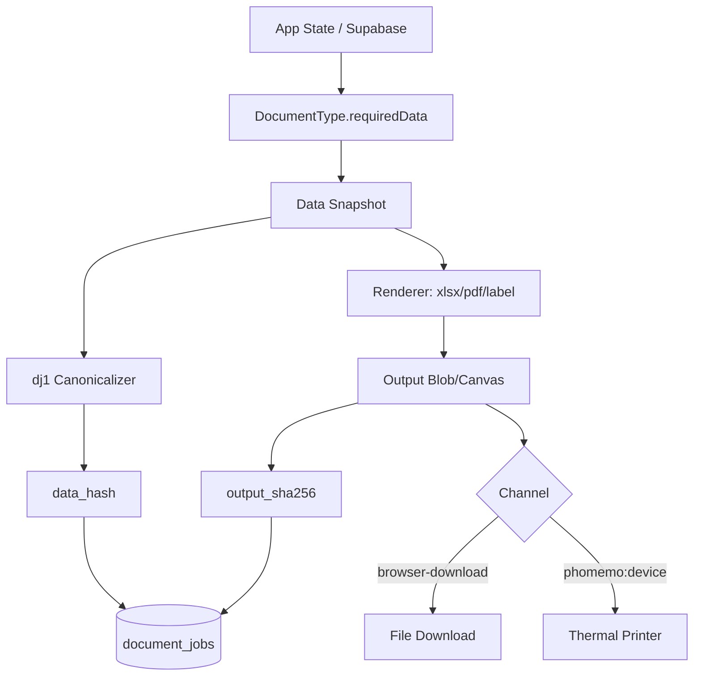

# PRINT HUB: IMPLEMENTATION PLAN

**Document Date:** 2026-10-05
**Owner:** Antigravity Swarm Coordinator
**Target File:** `docs/print/PRINT_HUB_IMPLEMENTATION_PLAN.md`

## 1. Goal, Scope, and Principles

**Goal:** The Printables Hub is a centralized, unified module within Onyx.mx that concentrates every file generation and print job—including Phomemo labels, XLSX workbooks, PDFs, and CSV exports—into a single architecture. It ensures deterministic outputs, rigorous cryptographic tracking via the `dj1` checksum ledger, and native integration with the Onyx Island command surface for Season 826 and beyond.

**Scope:** 
* **What it is:** A presentation and tracking overhaul. It centralizes rendering engines, enforces strict design systems, logs all document generation to a unified `document_jobs` ledger, and exposes print queues and verifications to the Onyx Island and the Onyx Chan MCP agent.
* **What it is not:** It is not a data schema migration for business domains. The logic determining pricing, shipment payloads, and inventory states remains untouched. No existing data columns or formats reviewed in PM1 to PM3 will be dropped or lost.

**Principles & Design Rules:**
* **Apple-Design Language:** 
  * PDFs must strictly enforce a minimum 10pt typography scale. No 900 (Black) weights. Colors must survive grayscale printing (e.g., `#475569` for secondary text). 
  * Thermal labels must adhere to a strict 1-bit monochrome contrast constraint (`#000000` and `#FFFFFF` only). No partial opacities or anti-aliased web fonts.
* **Deterministic Rendering:** Every data snapshot input must be canonicalized reproducibly so its `dj1` SHA-256 hash can be verified in the future, regardless of the rendering date or operator.
* **Fail Soft:** If the `document_jobs` table is missing (e.g., migration not applied), the application must fail softly, logging the error and allowing the file generation/download to proceed without interrupting operations.
* **Immutable Provenance:** The document ledger is append-only.

## 2. Current State

The platform currently operates with fractured, duplicated export paths. Most formats are not logged in the database, leaving no audit trail.

### Logged Formats (Legacy)
* `lbl-item-template-v4`: `LabelWizard.tsx` (`ONYX_MASTER_TEMPLATE_V4`). Writes to `print_jobs` and `print_job_items`.

### Unlogged Formats
* **XLSX Exports:**
  * `fmt-inventory-selected-xlsx`: `MainHeader.tsx` (`handleExportSelectedXLSX`)
  * `fmt-master-book-326-xlsx`: `MainHeader.tsx` (`handleMasterExportXLSX`)
  * `fmt-workbook-v2-xlsx`: `MainHeader.tsx` (`handleMasterExportXLSX_V2`)
  * `fmt-shopify-matrixify-main-xlsx`: `MainHeader.tsx` (`handleShopifyExportXLSX`)
  * `fmt-shopify-batch-wizard-xlsx`: `BatchProcessingWizard.tsx` (`buildXlsx`)
  * `fmt-trucking-manifesto-xlsx`: `TruckingModule.tsx` (`generateManifesto`)
  * `fmt-trucking-crates-spreadsheets-xlsx`: `TruckingModule.tsx` (`generatePacked`)
  * `fmt-trucking-trailer-packing-list-xlsx`: `TruckingModule.tsx` (`generatePackingListXlsx`)
  * `fmt-crates-wizard-packing-list-xlsx`: `ExportCratesWizard.tsx` (`generatePackingListXlsx`)
  * `fmt-packing-printables-wizard-xlsx`: `PackingModule.tsx` (`handleGenerateXLSX`)
  * `fmt-packing-raw-xml-xlsx`: `PackingModule.tsx` (`handleExportXLSX`)
* **PDFs & HTML Manifests:**
  * `pdf-inventory-sheet`: `pdfExport.ts` (`drawCatalogHubPage`)
  * `pdf-crate-manifesto`: `crateManifesto.ts` (`exportCrateManifesto`)
  * `html-trailer-manifest`: `generatePackingListHtml.ts` (`generatePackingListHtml`)
  * `html-crates-manifest`: `generateCratesListHtml.ts` (`generateCratesListHtml`)
  * `pdf-viewer-export`: `ViewerView.tsx` (`ViewerView`)
* **Other Labels & Exports:**
  * `lbl-packing-batch`: `PackingModule.tsx` (`buildBatchJSON`)
  * `lbl-preview-m110`: `PreviewLabels.tsx`
  * `lbl-nfc-card`: `LabelVisuals.tsx` (`NFCTagCard`)
  * `fmt-archive-season-825-csv`: `ArchivePanel.tsx` (`handleExportCSV`)
  * `fmt-vendor-batch-create-import-xlsx`: `batchSheet.ts` (`parseSheet` - Import only)

### Implemented Foundation
* `src/lib/documentJobs.ts`: Provides `dj1` canonical JSON hashing, `recordDocumentJob`, `verifyDocumentJob`, and fails softly if tables are missing.
* `src/features/print/PrintJobsPanel.tsx` & `printTools.tsx`: Basic Print Jobs widget integrated into the Island registry.
* `supabase/migrations/20261005120000_document_jobs.sql`: Draft migration for the append-only ledger schema.

## 3. Target Architecture

### Components
* **Document Type Registry:** Defines a strict `DocumentType<TSource, TSnapshot>` interface decoupling data extraction (`requiredData`), canonicalization (`buildSnapshot`), and generation (`render`).
* **Renderers:** 
  * `xlsxRenderer.ts` (using ExcelJS with `ONYX_WORKBOOK_THEME`).
  * `pdfRenderer.ts` (using jsPDF with strict typographic presets).
  * `labelRenderer.ts` (1-bit `<canvas>` rendering for Phomemo and standard labels).
  * `csvRenderer.ts` (Standardized CSV exporter with injection protections).
* **Job Lifecycle & Ledger:** Mapped directly to `document_jobs` (immutable header) and `document_job_events` (append-only statuses: `requested`, `rendered`, `printed`, `downloaded`, `reprinted`, `void`). 
* **Checksum Capture (dj1):** Canonical RFC 8785 JSON of the data snapshot is hashed to produce `data_hash`. The finalized binary output is hashed to produce `output_sha256`.
* **Channels:** Outputs target distinct channels—`browser-download` for files, `phomemo:<device>` over WebBluetooth, and `print-dialog` for HTML wrappers.
* **Offline Behaviour:** A local `document_jobs_outbox` (via RxDB or similar local store) will spool requested jobs and their states offline, syncing idempotently to Supabase when connectivity restores.
* **Season Scoping:** Every job requires explicit scoping to `'826'` or `'legacy'` (resolving to v825/v326), stamping the ledger for exact tracking.
* **Roles & Permissions:** RLS enforced. Vendors view only their own documents; Admin/Developer view all.

### UI & Island Integration
* **Island Tool:** `PrintToolsRegistrar` supplies compact launchers (e.g., active printer status or pending jobs) next to the Onyx Chan face.
* **Full Print Center:** An expanded surface featuring:
  * **Tabs:** Labels, PDFs, Spreadsheets.
  * **History:** Chronological ledger of jobs (filtered by Season), displaying the `dj1` hash, user, and status.
  * **Actions:** One-click "Reprint" (spawns child job) or "Download".
  * **Verify Zone:** A drag-and-drop area where users can drop a document to verify its bytes (`output_sha256`) or input a `dj1` hash to audit the original ledger snapshot.

### Agent Tools (MCP Bridge)
Onyx Chan accesses the Hub via new tools exposed through the MCP Bridge:
* `list_documents(season, kind)`
* `generate_document(template_id, params)`
* `reprint_document(job_id)`
* `verify_document(hash)`

### Data-Flow Diagram



## 4. Migration Matrix

| Call Site | Format | Data Source | Target Type | Renderer | Ledger Fields | Risk | Phase |
|---|---|---|---|---|---|---|---|
| `MainHeader.tsx:1433` | `fmt-inventory-selected-xlsx` | `inventory`, `selectedIds` | `xlsx` | `xlsxRenderer` | `season`, `items` | Low | 3 |
| `MainHeader.tsx:1621`, `2724` | `fmt-master-book-326-xlsx`, `fmt-workbook-v2-xlsx` | `inventory`, `production`, `financeDocs`, `shipments` | `xlsx` | `xlsxRenderer` | `season`, `workbook` | Med | 3 |
| `MainHeader.tsx:3534` | `fmt-shopify-matrixify-main-xlsx` | `inventory`, AI metadata | `xlsx` | `xlsxRenderer` | `season`, `items` | Low | 3 |
| `BatchProcessingWizard.tsx:440` | `fmt-shopify-batch-wizard-xlsx` | Batch execution queue | (Deprecate) | N/A | N/A | Low | 6 |
| `TruckingModule.tsx:1934`, `2153`, `2667` | `fmt-trucking-*-xlsx` | `truckCrates`, `shipments` | `xlsx` | `xlsxRenderer` | `manifest_id`, `crate_logistics_id` | Med | 4 |
| `ExportCratesWizard.tsx:110` | `fmt-crates-wizard-packing-list-xlsx` | `selectedCrates` | `xlsx` | `xlsxRenderer` | `crate_logistics_id` | Med | 4 |
| `PackingModule.tsx:174`, `569` | `fmt-packing-printables-wizard-xlsx`, `fmt-packing-raw-xml-xlsx` | `selectedItems` | `xlsx` | `xlsxRenderer` | `season`, `items` | High | 4 |
| `ArchivePanel.tsx:62` | `fmt-archive-season-825-csv` | `items`, `finance` | `csv` | `csvRenderer` | `season: 'legacy'`, `workbook: 'v825'` | Low | 3 |
| `pdfExport.ts:323`, `704` | `pdf-inventory-sheet` | `inventory` | `pdf` | `pdfRenderer` | `season`, `items` | Low | 2 |
| `crateManifesto.ts:235` | `pdf-crate-manifesto` | crates data | `pdf` | `pdfRenderer` | `manifest_id`, `crate_logistics_id` | Med | 2 |
| `generatePackingListHtml.ts:3`, `generateCratesListHtml.ts:3` | `html-trailer-manifest`, `html-crates-manifest` | `truckStats`, crates | `pdf` | `pdfRenderer` | `manifest_id` | High | 2 |
| `LabelWizard.tsx:624` | `lbl-item-template-v4` | `inventory` | `label` | `labelRenderer` | `season`, `items`, `legacy_print_job_id` | High | 1 |
| `PackingModule.tsx:36` | `lbl-packing-batch` | `inventory` | `label` | `labelRenderer` | `season`, `items` | Med | 1 |

## 5. Phases

### Phase 0: Foundation
* **Objective:** Establish the registry, types, base renderers, and verify Ramses has applied the migration.
* **Tasks:**
  * **PH-0A (Gemini Pro):** Initialize `src/features/print/registry.ts`, `types.ts`, and core `jobService.ts`.
  * **PH-0B (Gemini Pro):** Implement `xlsxDesignSystem.ts` and `pdfDesignSystem.ts` (Apple-design tokens).
* **Dependencies:** Ramses applying `document_jobs` migration.
* **Risks:** Migration conflicts. Rollback by disabling feature flag.

### Phase 1: Labels (Phomemo)
* **Objective:** Unify 1-bit thermal label generation and dual-write jobs to `document_jobs` and `print_jobs`.
* **Tasks:**
  * **PH-1A (Gemini Pro):** Implement `labelDesignSystem.ts` and `labelRenderer.ts`.
  * **PH-1B (Gemini Pro):** Refactor `LabelWizard.tsx` (V4 template) to use the new renderer and `recordDocumentJob`. Dual-write to `print_jobs`.
  * **PH-1C (flash):** Migrate `PackingModule.tsx` batch labels to `labelRenderer.ts`.
* **Dependencies:** Phase 0.
* **Risks:** Phomemo driver changes break connectivity. Ramses must test physically.

### Phase 2: PDFs
* **Objective:** Port HTML manifests and existing PDF generators to the unified 10pt minimum `pdfRenderer`, capturing hashes.
* **Tasks:**
  * **PH-2A (Gemini Pro):** Migrate `pdfExport.ts` (Catalog Hub) and `crateManifesto.ts`.
  * **PH-2B (Gemini Pro):** Port `generatePackingListHtml.ts` and `generateCratesListHtml.ts` to jsPDF via `pdfRenderer.ts`. Fix 6pt microscopic fonts and contrast ratios.
* **Dependencies:** Phase 0.
* **Risks:** Layout clipping with larger fonts.

### Phase 3: XLSX Spreadsheets
* **Objective:** Consolidate Master Workbooks and Shopify Matrixify generators onto ExcelJS with uniform styling.
* **Tasks:**
  * **PH-3A (Gemini Pro):** Migrate `MainHeader.tsx` `handleMasterExportXLSX_V2` and `handleExportSelectedXLSX`.
  * **PH-3B (Gemini Pro):** Migrate Matrixify export (`MainHeader.tsx:3534`) to the new renderer, logging to ledger.
  * **PH-3C (flash):** Migrate `ArchivePanel.tsx` CSV export to use standardized `csvRenderer.ts`.
* **Dependencies:** Phase 0.

### Phase 4: Logistics Tracking & Reconciliation
* **Objective:** Port Trucking & Packing module XLSX exports. Expose full Print Center UI to verify 826 logistics checksums.
* **Tasks:**
  * **PH-4A (Gemini Pro):** Consolidate `fmt-trucking-trailer-packing-list-xlsx` and `fmt-crates-wizard-packing-list-xlsx` into one shared renderer module.
  * **PH-4B (Gemini Pro):** Port `fmt-packing-printables-wizard-xlsx` (deprecate raw XML usage).
  * **PH-4C (Gemini Pro):** Build the full `PrintCenter.tsx` surface (History, Verify drag-and-drop tab, Reprinting).
* **Dependencies:** Phase 3.

### Phase 5: Agent Tools
* **Objective:** Expose generation and verification to Onyx Chan.
* **Tasks:**
  * **PH-5A (Gemini Pro):** Implement MCP tool handlers for `list_documents`, `generate_document`, `reprint_document`, and `verify_document` in `src/features/onyxAgent/mcp/`.
* **Dependencies:** Print Center API completeness.

### Phase 6: Cleanup
* **Objective:** Remove deprecated exporters, old old-bar buttons, and backfill legacy jobs.
* **Tasks:**
  * **PH-6A (flash):** Delete `BatchProcessingWizard.tsx` XLSX builder and `xlsxUtils.tsx` direct XML methods.
  * **PH-6B (Gemini Pro):** Backfill script: Insert version-0 unverifiable rows into `document_jobs` mapped from `print_jobs`.
* **Dependencies:** Successful parity in Phases 1-4.

## 6. First Two Waves (Ready to Launch)

*Constraints: Max 6 tasks per wave, max 4 concurrent. Gemini Pro/Flash only.*

**Wave PH-0 (Foundation)**

| ID | Model | Files Owned | Objective |
|---|---|---|---|
| PH-0A | Gemini 3.1 Pro (High) | `src/features/print/types.ts`, `src/features/print/registry.ts`, `src/features/print/jobService.ts` | Define DocumentType contract and job service lifecycle. |
| PH-0B | Gemini 3.1 Pro (High) | `src/features/print/design/xlsxDesignSystem.ts`, `src/features/print/design/pdfDesignSystem.ts` | Define unified visual tokens (10pt rules, ONYX_WORKBOOK_THEME). |
| PH-0C | Gemini 3.1 Pro (High) | `src/features/print/PrintCenterIsland.tsx`, `src/features/print/printTools.tsx` | Wire compact Island launchers to the registry. |

**Wave PH-1 (Labels & Renderers)**

| ID | Model | Files Owned | Objective |
|---|---|---|---|
| PH-1A | Gemini 3.1 Pro (High) | `src/features/print/design/labelDesignSystem.ts`, `src/features/print/renderers/labelRenderer.ts` | Implement strict 1-bit thermal canvas generator. |
| PH-1B | Gemini 3.1 Pro (High) | `src/features/logistics/LabelWizard.tsx` | Refactor V4 template to `labelRenderer.ts`, wire `recordDocumentJob`. |
| PH-1C | flash tier | `src/features/logistics/PackingModule.tsx` | Route batch labels to `labelRenderer.ts`. |
| PH-1D | Gemini 3.1 Pro (High) | `src/features/print/renderers/xlsxRenderer.ts`, `src/features/print/renderers/pdfRenderer.ts` | Implement baseline jsPDF and ExcelJS engine shells. |

**Merge Order:** Merge PH-0A -> PH-0B -> PH-0C. Run Typecheck. Merge PH-1A -> PH-1D -> PH-1B -> PH-1C.

## 7. Data and Tracking

### Ledger Columns
* `document_jobs`: `id`, `job_ref`, `kind`, `template_id`, `template_version`, `season`, `workbook`, `manifest_id`, `crate_logistics_id`, `batch_id`, `parameters`, `data_snapshot`, `hash_version`, `data_hash`, `output_sha256`, `output_bytes`, `file_name`, `channel`, `parent_job_id`, `legacy_print_job_id`, `client_created_at`, `created_by`, `created_at`.
* `document_job_events`: `id`, `job_id`, `status`, `at`, `by`, `output_sha256`, `detail`.
* `document_job_items`: `job_id`, `inventory_id`, `season`, `tag_id`, `item_ref`, `crate_logistics_id`, `copies`.

### Checksum Recipe (dj1)
1. Envelope: `{ "v":1, "kind", "template", "season", "scope", "params", "rows" }`.
2. Sorting: Object keys sorted by Unicode code point. Rows sorted by `(season, vendor_prefix, item_id)`. Label copies are counted via a `copies` property, not row duplication.
3. Normalization: NFC normalized, trimmed strings. Missing values drop to `null`.
4. Numbers/Dates: Finite numbers only, ISO 8601 UTC with `Z` for dates.
5. Volatility: Ignore `printed_at`, output URLs, users, and temporary IDs.
6. Hashing: SHA-256 encoded as lowercase hex, prepended with `dj1:`.

### 826 Logistics Checksums
To ensure total tracking for Season 826, every generated document intersecting the logistics pipeline (manifests, crates, pack lists, labels) must compute and log its `dj1` hash against `manifest_id` or `crate_logistics_id`. The History view filters `season = '826'` to provide a comprehensive audit of generated materials. 

### Draft Migration Changes
Before Ramses applies `20261005120000_document_jobs.sql`:
1. Verify that `public.get_my_app_role()` accurately resolves roles like 'Developer' and 'Admin'.
2. Ensure `auth.uid()` correctly references `auth.users(id)`.
3. Add a clarifying comment explaining `legacy_print_job_id` maps to existing `print_jobs(id)` for dual-write compatibility.

## 8. Design

### Tokens & Apple-Design Principles
* **PDFs:** 
  * Margins: Global 15mm.
  * Typography: 10pt minimum for all body/table data. 24pt for display IDs. Sentence case data. NO 900 weight (Black) fonts.
  * Contrast: Remove white-on-dark inversions (consumes toner, bleeds). Use `#475569` for secondary text to satisfy WCAG 4.5:1.
* **Labels:** 
  * Strict 1-bit monochrome (`#000000` and `#FFFFFF`). No opacities.
  * Pixel-hinted sans-serif typography.
  * Fixed 4-module quiet zone around QRs.
* **Hub UI Wireframe:**
  * Top bar: Title "Print Center", Season Selector (825 / 826).
  * Navigation Pane: Queued, History, Verify, Printers.
  * History List: `Icon [Kind] | Status Pill | Job Ref | Checksum [Copy] | Date | [Download] [Reprint]`.
  * Verify Zone: Droppable dashed-border area. "Drop PDF/XLSX to Verify" or "Paste dj1 Hash".

## 9. Test and Verification Plan

1. **Golden Files:** Every renderer must have a Jest snapshot test passing a standard mock payload and comparing the structured output against a "golden" expected output (e.g. column matching, structural checks).
2. **Checksum Round-Trip:** Test `buildSnapshot` by feeding the same mock payload on two different simulated dates. The `data_hash` must be strictly identical.
3. **Phomemo Device Checklist:** Ramses must physically pair the M110, print a V4 template label, and verify 1-bit rendering (no dithering or illegible tiny text).
4. **Visual Review:** Ramses provides screenshots of the Print Center History view and the compact Island launchers.

## 10. Open Questions for Ramses & Risks

1. **Phomemo Reconnections:** The WebBluetooth driver lacks auto-reconnect. 
   * *Recommendation:* Prompt the user via an Island notification to "Reconnect Printer" if a queued job fails, rather than polling aggressively.
2. **Legacy Checksums (`print_jobs`):** Existing checksums used a raw stringify containing dates, making them impossible to re-verify. 
   * *Recommendation:* Backfill them with `hash_version = 0` and visually flag them in the UI as "Historical / Unverifiable".
3. **Shipment Payload Malleability:** `shipments.payload` is currently freeform JSON, risking canonicalization breaks. 
   * *Recommendation:* Implement a strict Zod schema parse for all payloads loaded from Season 826 onwards before feeding them to the snapshot builder.
4. **Role Permeability:** External vendors could potentially view Master Workbooks.
   * *Recommendation:* Strict RLS enforcing `created_by` access, alongside restricting certain `DocumentType` configurations to `['Developer', 'Admin']`.

## 11. Handoff Delta

**Append to `HANDOFF_JUAN117.md` (Section 4 - Current State / NOT STARTED):**
```markdown
| `docs/print/PRINT_HUB_IMPLEMENTATION_PLAN.md` | Print Hub Plan | Accepted. Outlines the 6-phase migration to the `document_jobs` ledger, unified renderers, and strict Apple-design print presets. |
```

**Append to `HANDOFF_JUAN117.md` (Section 8 - WAVE V Proposal or Next Wave):**
```markdown
| **PH-0A** | Gemini 3.1 Pro (High) | `src/features/print/types.ts`, `registry.ts`, `jobService.ts` | Initialize Print Hub base types and lifecycle. | No |
| **PH-0B** | Gemini 3.1 Pro (High) | `src/features/print/design/xlsxDesignSystem.ts`, `pdfDesignSystem.ts` | Implement strict 10pt PDF rules and XLSX theme. | No |
| **PH-0C** | Gemini 3.1 Pro (High) | `src/features/print/PrintCenterIsland.tsx`, `printTools.tsx` | Wire Island launchers for the Hub. | No |
```

**Append to `STATE_FACTS.md` (Waiting on Ramses):**
```markdown
- Apply the `20261005120000_document_jobs.sql` migration so the Print Hub can begin Phase 0 foundation work. Verify RLS `get_my_app_role()` strings.
```

## 12. Chief amendments (Juan117, 2026-10-05, after review of the draft)

These override the sections above where they differ.

1. **Phase 0 does not wait for the migration.** `documentJobs.ts` fails soft when the tables are missing, so the registry, design systems, renderers and Print Center shell are built and merged first. Only the ledger-backed views (verify, dj1 history) need `20261005120000_document_jobs.sql` applied by Ramses. The migration already contains `document_jobs`, `document_job_events`, `document_job_items`, the `document_jobs_current` view and the append-only triggers.
2. **No test runner exists in the repo** (no vitest or jest, no test files). Section 9's Jest snapshots become: pure functions plus a dev self-test (`src/features/print/selfTest.ts`, dj1 round trip on two simulated dates, canonical JSON key order, label copies) that can be run from the Print Center and by the agent tool. Adding vitest is a question for Ramses (default: not now; no new npm packages).
3. **No RxDB.** The offline outbox is a small IndexedDB or localStorage queue written by the job service, flushed on reconnect; no new dependency.
4. **The Print Center is not a new app view.** Adding a view would touch the huge `activeViewAtom` union in `src/lib/atoms.tsx`. Instead: an island tool "Print Center" and a sidebar entry both flip one new atom (`isPrintCenterOpenAtom` in `src/features/print/printState.ts`), and the Print Center is a full glass sheet (portal on document.body, island language, ui-root) with tabs Queue, History, Verify, Printers, Templates. The Chief mounts it once in `MainAppView.tsx`.
5. **Print Center shell moves into Wave PH-0** (task PH-0C) so Ramses sees the hub early; History reads the existing `PrintJobsPanel` data (legacy `print_jobs` and `document_jobs` when present).
6. **Wave PH-0 (launched first):** PH-0A types, registry, job service; PH-0B design systems for xlsx, pdf and labels; PH-0C Print Center shell, state atom, island tool; PH-0D csv renderer and the dj1 self-test. Wave PH-1 stays as in section 6 (labels renderer and LabelWizard wiring, renderer shells), and call-site wiring tasks are always single-owner on the file they touch, one at a time.
7. **Shared-file rule:** `MainHeader.tsx`, `TruckingModule.tsx`, `PackingModule.tsx`, `LabelWizard.tsx` and `BatchProcessingWizard.tsx` are huge. Agents get a source extract of the call site (script-generated, with line numbers) and return a patch description or the new component file; the Chief (or the Antigravity coordinator) applies the small edit in the big file.
